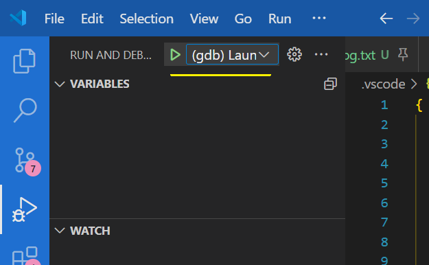

# KCG 项目介绍
## 1 项目结构

python前端 + MLIR后端
目前只简单地封装了调用核函数的逻辑，可实现用户在python端传入config，之后进行kenrel生成并执行
缓存系统还没做。因此目前会生成很多文件

MLIR后端入口点：test/test.cc  提供了lib和exe两种编译选项。在CMakeLists.txt中设置ON或OFF，或者：
```sh
cmake .. -DCOMPILE_AS_PYMODULE=ON
```

## 2.构建&运行方法
### 2.1 构建
新建build文件夹并进入。之后：
```sh
cmake .. -DCOMPILE_AS_PYMODULE=ON
make -j4
# 直接cmake .. 也可，会使用CMakeCache.txt中的配置
```

当需要切换构建选项时，需要删除build 目录下的CMakeCache.txt 否则会不生效

### 2.2 参数配置&运行
1. exe模式   
参数配置：debug用，只能用固定参数配置，在main函数中修改。只用于测试MLIR后端的lowering过程，不进行gemm的正确性测试
运行：
```sh
${project_folder}/bin/kcg_compiler > log.txt 2>&1
```
   
调试：f5进入调式模式。配置文件在 .vscode/launch.json 注意配置选择   
<p align = 'center'>

</p>

2. lib模式   

启动脚本为 CodeGenDemo/Runtime/python/kcg/Benchmark.sh 其调用testGetKernels.py ,并开启进程池处理编译和测试任务。该进程是会话分离的（nohup），即ssh链接断开后也不会停止
需要查看总体运行时间，执行 ： 
```shell
ps -eo pid,etime,cmd | grep testGetKernels
```


3. testGetKernels.py 使用说明
#### 运行机制   
1. 该程序首先读取用户的config参数文件，生成参数空间json，并根据 smallJsonLen 的值将空间拆分为若干小json存放在 _tmp 目录下   
2. 随后开始编译和benchmark。编译的进程池大小由 nProcess 决定。benchmark由守护进程和 perftest进程构成。perftest 执行测试，并将结果存入 perfPAth 为前缀指定的json中。
守护进程检测到 perftest 意外退出时，会重启perftest进程，并将结果记录到另一个json中。该json的名称从0开始，随着重启次数依次+1 （如 perflog_0.json, perflog_1.json）等

#### 目录说明
- _pkl : kernel信息文件存在 _pkl 目录下，目前一个pkl对应一个kernel信息。perftest进程会每隔一段时间检测 _pkl 下的文件并测试。测试完成的pkl文件会被删除；
- _cache : 存放MLIR编译阶段的缓存文件（kernel的loader、launcher的源码和二进制文件）
- _tmp : 存放调优空间拆分后的json文件
- _override : 目前无作用
- _dump : 存放MLIR编译的中间文件(.o,.bc)等
- TuningConfigs ： 存放调优空间定义文件。通过该文件生成调优空间。默认调优空间文件名称为 cfg_combinations.json 

#### 参数说明
testGetKernels.py   
```python
    # 路径管理器初始化。新建目录并清理目录下文件。通过clearXXX指定是否要删除已有文件
    PathManager.init(clearPkl=True, clearTmp=True, clearCache=True)
    # 调优参数配置文件，决定了各个参数的可取值范围
    tuning_param_file = '/home/xushilong/CodeGenDemo/TuningConfigs/GEMM_configs.json'
    # 是否使用已生成好的 cfg_combination 文件. 如果为空字符串，则通过 tuning_param_file 生成；否则跳过调优空间生成过程，直接读取 preGeneratedCombinations 指定的json
    preGeneratedCombinations = '/home/xushilong/CodeGenDemo/cfg_cominations_1.json'
    # [for debug use] 是否从已生成的 subjson 开始处理。若非空字符串，则会跳过 _tmp 目录下 startFromSubJson 指定文件之前的所有json配置
    startFromSubJson = '/home/xushilong/CodeGenDemo/_tmp/tmp_json_33400_33600.json'
    # 输出perf文件前缀，该文件记录了 topK 的最好结果
    perfPAth = '/home/xushilong/CodeGenDemo/perfRecordlog_5'
    
    '''
        文件生成关系：
        tuning_param_file -> cfg_combinations.json -> 拆分为 subjson, 存到tmp/中
        tuning_param_file 定义调优空间
        cfg_combinations.json 是所有参数的组合
        subjson 是 cfg_combinations.json 拆成的一堆小文件
    '''
    # DeviceInfo.set_current_device(7)
    print(f'===== Set current device to {DeviceInfo.get_current_device()} =======')
    print('==== waiting for config_gen ==== ')
    nProcess = 100 # 用于编译的最大进程数
    smallJsonLen = nProcess * 5  # 调优空间拆分为单个小json文件时，单个小json含有的configs上限
    
    tempfileNames,totalLen = config_gen(tuning_param_file, preGeneratedJson= preGeneratedCombinations , singleLength = smallJsonLen)
    print('==== config_gen Done! Start deal ==== ')
    # benchmarkcnt ：单个case执行几次测试
    # warmupcnt ： 单个case执行几次warmup
    # keepTopNum ：保留前几的最好结果
    # needCompile ：是否执行编译过程
    # needPerfTest ： 是否执行benchmark过程
    tm =  ParallelTaskManager(totalLen, tempfileNames, perfPAth, benchmarkcnt=10, warmupcnt=1, devId=DeviceInfo.get_current_device(), keepTopNum = 15)
    tm.run(maxProcess= nProcess , startFromSubjson = '', needCompile=True, needPerfTest=True)

```
Benchmark.sh   
```shell
#! /bin/bash
export PYTHONPATH=~/CodeGenDemo/Runtime/python
cd ~/CodeGenDemo/Runtime/python/kcg
export HIP_VISIBLE_DEVICES=7  # 指定使用的DCU设备
nohup python testGetKernels.py > log.log 2>&1 & # 开启任务并将其和会话分离（父进程ID=1）

```